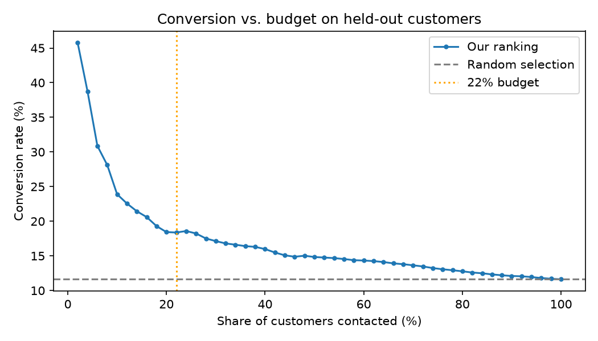

# Bank Telemarketing Targeting

**Who should a bank call first when the call budget is limited?**

Using 45,211 telemarketing contacts from a Portuguese bank, I built a simple, explainable customer-prioritisation rule. On held-out customers it **lifts conversion from 11.6% to 18.4% (+58%)** when contacting 22% of the list, and to **33.9% (2.9x)** when contacting the top 5%.



## Recommendations

1. **Prioritise by job × age segment.** Customers aged 61+ (42% conversion) and 18–25 (24%) convert far above the 11.7% baseline, but they make up only ~6% of contacts.
2. **Cap at 3 calls per customer.** Calls from the 4th attempt onward were 29% of all calls but produced only 13% of conversions. Redirecting them to first calls on new customers is estimated at **+1,400 conversions (+26%) with the same number of calls**.
3. **Tier the outreach.** Top ~10%: up to 3 calls by experienced agents. Next tier: 1–2 calls. The rest: cheaper channels (SMS / email).

## How I got there

| Question | Approach |
|---|---|
| Is the data reliable? | Found hidden missing values (`unknown`, `pdays = -1`) that `isnull()` misses, and classified them: not applicable, missing at random, or systematic gaps |
| Who to call? | Conversion rate, **95% Wilson confidence interval** and lift per segment; ranked by the lower bound so small, noisy segments don't dominate |
| When to stop calling? | Corrected for **selection bias**: computed the success rate of the *k*-th call among customers still being called, not the raw rate by total calls |
| When / how to call? | Month and contact method are **confounded with time** (no year column); stratified checks showed month alone can't control for it, so no recommendation was made |
| Does it work? | Built the ranking on a 70% training set and evaluated it on a **30% held-out test set** |

## Limitations

- `duration` (call length) is excluded because it is only known after the call (**data leakage**).
- Each row is a **contact, not a unique customer**. Some customers appear more than once, so observations are not fully independent.
- The data has no year column (May 2008 – Nov 2010), so time effects cannot be fully separated.
- The data identifies who converts, not who converts **because** they were called. Measuring true incremental impact needs a control group / A/B test.

## Next steps

- Add other pre-call features (previous campaign outcome, balance, loans) to better separate the large middle group.
- Validate the call cap and the ranking with an A/B test before rollout.

## Repository structure

```
├── data/bank-full.csv         raw data (unmodified)
├── images/                    charts used in this README
├── analysis.ipynb             full analysis with commentary
├── explore.py                 data-quality checks
└── requirements.txt           pinned dependencies
```

## Run locally

```
python -m venv .venv
.venv\Scripts\activate
pip install -r requirements.txt
```
Then open `analysis.ipynb` in VS Code (Jupyter extension) or Jupyter.

## Data

- **Source:** Moro, S., Rita, P., & Cortez, P. (2014). *Bank Marketing* [Dataset]. UCI Machine Learning Repository. https://doi.org/10.24432/C5K306
- **License:** [CC BY 4.0](https://creativecommons.org/licenses/by/4.0/)

## Acknowledgement

The project idea was inspired by [Rajverma1718/bank-marketing-analysis](https://github.com/Rajverma1718/bank-marketing-analysis). All code and analysis in this repository are my own.